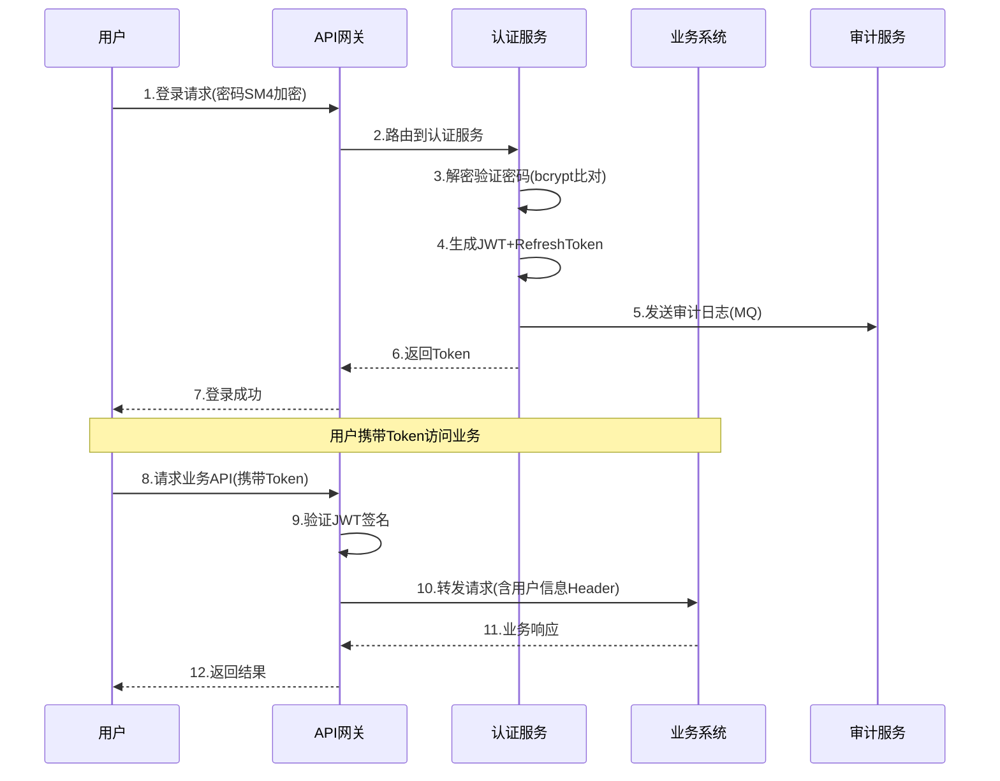

# 公共部分章节

## 一、统一认证机制

### 1.1 认证流程
所有业务系统接入统一认证中心，用户登录时由认证中心统一验证凭证，发放Token。各业务系统通过验证Token确认用户身份，无需自行实现认证逻辑。

### 1.2 会话管理
- 全局Session由认证中心维护（Redis集中存储）
- 各业务系统不维护独立Session，通过Token传递用户身份
- Token分AccessToken（15分钟）和RefreshToken（7天）

### 1.3 安全机制
- 密码传输：前端SM4加密 → 后端解密验证
- 密码存储：bcrypt(rounds=10) + 随机盐
- Token签名：RS256，2048位密钥对
- HTTPS：TLS 1.2以上，所有API强制HTTPS

## 二、日志审计公共模块

所有服务统一通过AOP切面在关键方法上标注@AuditLog注解，自动记录：
- 操作人（从SecurityContext获取）
- 操作类型（LOGIN/CREATE/UPDATE/DELETE/ASSIGN）
- 资源ID和方法参数
- 操作结果（成功/失败+异常信息）
- 请求IP和User-Agent

日志通过RabbitMQ异步发送至审计服务写入ES，不阻塞业务主流程。

## 三、API网关公共能力

### 3.1 全局认证拦截
API网关统一校验所有请求的JWT Token，白名单路径（/api/public/**）除外。

### 3.2 限流熔断
- 限流：每客户端IP每秒100次请求，超出返回429
- 熔断：后端服务连续失败率超过50%时熔断5秒
- 降级：熔断期间返回友好错误提示

### 3.3 请求日志
网关层记录所有请求的：方法、路径、响应时间、状态码，用于全局监控。

## 四、部署基础设施

### 4.1 容器化配置
- 每个微服务独立Docker镜像，基于OpenJDK 17 Alpine
- K8s Deployment配置：最小副本数2，HPA根据CPU/内存自动扩缩
- ConfigMap管理配置文件，Secret管理密钥

### 4.2 资源需求
| 服务 | CPU请求 | 内存请求 | CPU限制 | 内存限制 |
|------|---------|---------|---------|---------|
| API网关 | 500m | 512Mi | 2 | 2Gi |
| 用户管理 | 500m | 512Mi | 2 | 2Gi |
| 认证服务 | 1 | 1Gi | 4 | 4Gi |
| 权限管理 | 500m | 512Mi | 2 | 2Gi |
| 审计服务 | 500m | 1Gi | 2 | 4Gi |

### 4.3 国产化适配
- OS：麒麟V10（ARM64）
- 数据库：达梦DM8 → 驱动替换为dm.jdbc.driver.DmDriver
- 应用服务器：东方通TongWeb → 替换内嵌Tomcat
- 缓存：Redis兼容 → 麒麟ARM版Redis或KeyDB

## 五、mermaid代码

