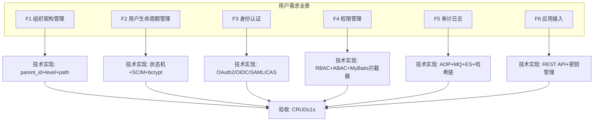
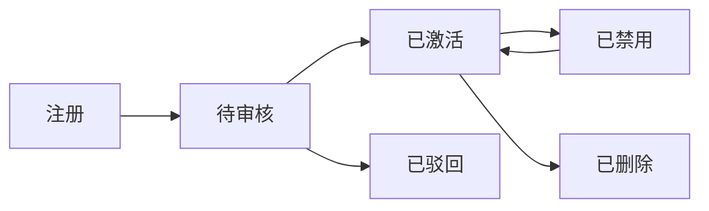
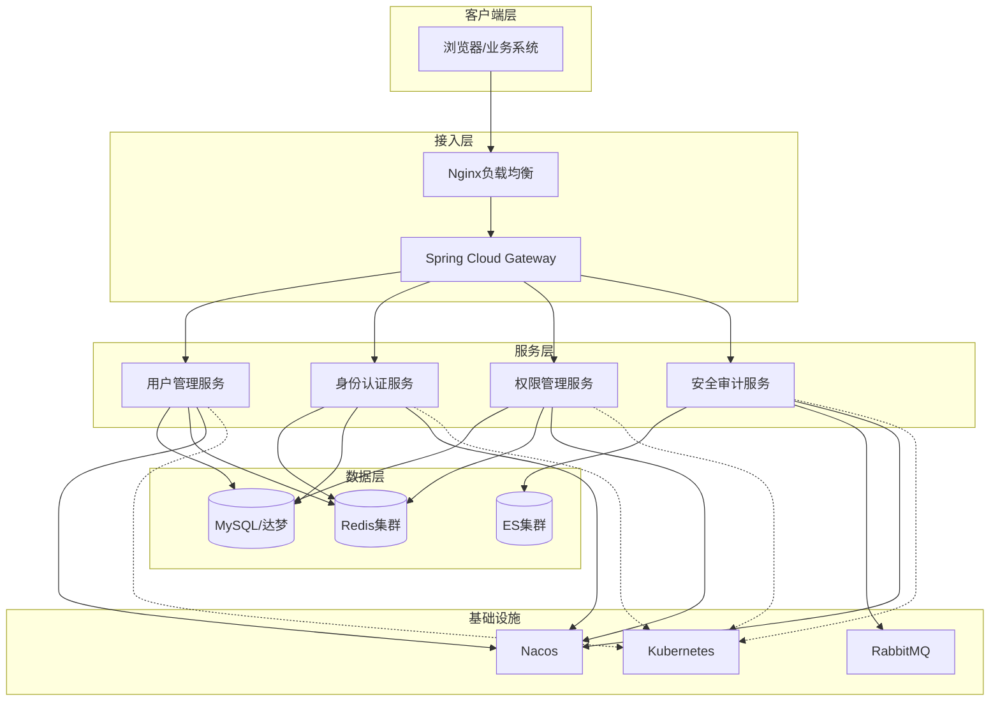
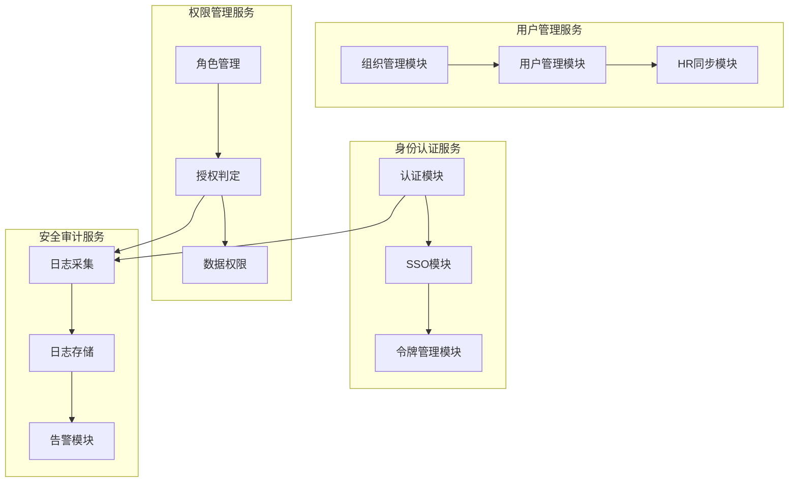
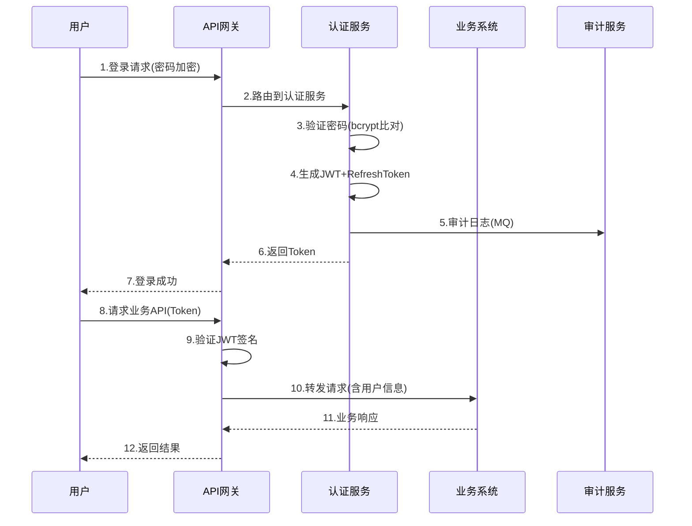

# 图例汇总（mermaid→drawio→PNG）

> 收集自：需求分析 / 总体方案 / 分项方案 / 公共部分 / 原型设计

## 一、需求全景图

**来源**: 需求分析智能体 (001_requirement.md)
**编号**: 图1-1
**类型**: graph TD 流程图
**用途**: 方案书第二章·需求分析 开头综述

## 二、用户状态机图

**来源**: 需求分析智能体 (001_requirement.md)
**编号**: 图1-2
**类型**: graph LR 状态流转图
**用途**: 方案书2.2节·用户生命周期

## 三、系统总体架构图

**来源**: 总体方案智能体 (002_architecture.md)
**编号**: 图2-1
**类型**: graph TB 分层架构图
**用途**: 方案书3.1节·总体架构

## 四、服务模块关系图

**来源**: 分项方案智能体 (003_subproject.md)
**编号**: 图3-1
**类型**: graph TB 模块关系图
**用途**: 方案书4.1-4.4节·各服务内部结构

## 五、SSO认证时序图

**来源**: 公共部分智能体 (004_common.md)
**编号**: 图4-1
**类型**: sequenceDiagram 时序图
**用途**: 方案书3.2节·认证流程说明

## 六、标准化输出对照表

| 编号 | 图名 | 类型 | 插入位置 | mermaid源 | drawio | PNG |
|:---:|------|:---:|---------|:--------:|:------:|:---:|
| 1-1 | 需求全景图 | graph TD | 第二章开头 | ✅ | - | - |
| 1-2 | 用户状态机 | graph LR | §2.2 | ✅ | - | - |
| 2-1 | 系统架构图 | graph TB | §3.1 | ✅ | - | - |
| 3-1 | 服务模块关系 | graph TB | §4.1-4.4 | ✅ | - | - |
| 4-1 | 认证时序图 | sequence | §3.2 | ✅ | - | - |

> **说明**: mermaid代码可直接进方案书。后续可通过 mermaid-cli (mmdc) 将 mermaid 转为 SVG/PNG，或通过 drawio 重新绘制为标准化格式。
